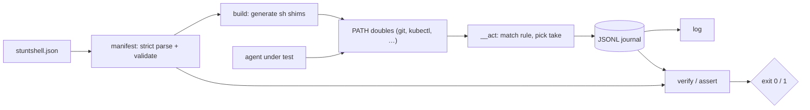

# stuntshell

[English](README.md) | [中文](README.zh.md) | [日本語](README.ja.md)

[](LICENSE) [](go.mod) [](CHANGELOG.md)  [](CONTRIBUTING.md)

**stuntshell：宣言的なマニフェストから偽のコマンドライン実行ファイル——「スタントダブル」——を生成し、すべての呼び出しを記録して結果にアサーションをかける、オープンソースでゼロ依存の CLI。`git` や `kubectl` を実行するエージェントを決定的にテストできる。**


```bash
git clone https://github.com/JaydenCJ/stuntshell && cd stuntshell
go build -o stuntshell ./cmd/stuntshell    # single static binary, stdlib only
```

> プレリリース：v0.1.0 はまだどのパッケージレジストリにもタグ付けされていません。上記の通りソースからビルドしてください（Go ≥1.22 なら可）。

## なぜ stuntshell？

シェルコマンドを実行する AI エージェント（あるいは任意の自動化）をテストする人は、みな同じ壁にぶつかります。テストスイートに本物の `git push` や `kubectl delete` をさせるわけにはいかないので、PATH 上でコマンドを偽装するしかない。ところが、よくある偽装手段はどれも同じ弱点を抱えています。手書きのスタブスクリプトは挙動を十数ファイルに散らばらせ、互いにずれていき、何も記録しません——テストが失敗した*こと*は分かっても、*エージェントが実際に何を実行したか*は永遠に分からない。シェル関数モック（bats-mock / shellmock 系）は単一の bash プロセス内にしか存在せず、エージェントが Python や Node、派生したサブプロセスからコマンドを実行した瞬間に消えます。そして「エージェントは一度も force-push しなかった」を検証するには、スタブごとに形式の違う即席ログを grep する羽目になる。stuntshell はそのすべてを一つのマニフェストで置き換えます。各ダブルのルール（トークン単位の glob、失敗→成功のスクリプト化シーケンス、デフォルト応答）を宣言し、`stuntshell build` が PATH 上の*あらゆる*呼び出し元に効く本物の実行ファイルを生成、すべての呼び出しはタイムスタンプなしの単一 JSONL ジャーナルに落ち、`stuntshell verify` が宣言済みの期待——回数、argv パターン、順序、そして厳格な「想定外の呼び出しゼロ」——でジャーナルを裁定し、エージェントが逸脱した瞬間に終了コード 1 で報せます。

| | stuntshell | 手書き PATH スタブ | bats-mock / shellmock | エージェントフレームワークへのパッチ |
|---|---|---|---|---|
| 宣言的マニフェスト、事前バリデーション | ✅ | ❌ 即席スクリプト | ❌ テストごとにシェルを書く | ❌ フレームワークごとにコードを書く |
| どんな呼び出し元にも効く（Python・Node・サブプロセス） | ✅ 本物の実行ファイル | ✅ | ❌ bash 関数のみ | ❌ そのフレームワークのみ |
| 呼び出しジャーナル（argv・終了コード・cwd・stdin） | ✅ 単一 JSONL ファイル | ❌ 自作 | 部分的、モックごとにバラバラ | フレームワーク次第 |
| 回数 / argv / 順序 / 未呼び出し のアサーション | ✅ 組み込み | ❌ grep 頼み | 部分的 | ❌ 自作 |
| スクリプト化シーケンス（2 回失敗してから成功） | ✅ `script` テイク | ❌ 手動の状態ファイル | 部分的 | ❌ 自作 |
| 誰も想定しなかった呼び出しの検出 | ✅ strict モード | ❌ | ❌ | ❌ |
| ランタイム依存 | 0 | 0 | bash + フレームワーク | そのフレームワーク |

<sub>比較は 2026-07-13 に確認：stuntshell は Go 標準ライブラリのみを import し、生成される shim は素の POSIX sh なので、ダブル自体もゼロ依存です。</sub>

## 特長

- **マニフェスト駆動のダブル** — 厳格にパースされる 1 つの JSON ファイルがすべての偽コマンドを宣言。未知のキーやパターンの typo は `build` 時に失敗し、テスト時に黙って空振りすることはない。
- **本物のマッチング言語** — トークン単位の glob（`*`・`?`・エスケープ）、`...` 残余トークン、catch-all と空 argv ルール、先勝ちマッチ——`push origin *` と `push --force ...` を別のダブルにできる精度。
- **リトライロジック向けのスクリプト化テイク** — ルールの `script` は n 回目のマッチに n 番目の応答を返し、以降は最後のものを繰り返す。「2 回失敗してから成功」が状態ファイルではなく JSON の 3 行で書ける。
- **すべて記帳、計時は一切なし** — 各呼び出しは argv・命中ルール・終了コード・cwd・任意で stdin を、タイムスタンプを含まない JSONL ジャーナルに追記。同一の実行はバイト単位で同一の証拠を生む。
- **要件のように読めるアサーション** — `verify` は宣言された期待（完全一致または glob の argv、`min`/`max`/`exactly`、列挙順、厳格な想定外ゼロモード）を検査し、違反した期待を名指しして 1 で終了。`assert` はフラグから同じことをアドホックに行う。
- **自己完結の shim** — `build` は絶対パスをシェルクォート済みで小さな POSIX sh 実行ファイルに焼き込む。PATH の先頭にディレクトリを 1 つ足せば、プロセスツリー内のどの言語のどのプロセスもダブルに当たる。
- **ゼロ依存、完全オフライン** — Go 標準ライブラリのみ。ネットワークなし、テレメトリなし。`curl` を「失敗」させる最速の方法は、そもそも何も実際に接続させないこと。

## クイックスタート

```bash
stuntshell init                 # writes a starter stuntshell.json (git + kubectl doubles)
stuntshell build                # stages executables into .stunts/bin
eval "$(stuntshell path)"       # doubles now shadow the real commands
```

「エージェント」——ここではあなたのシェル——を動かし、ダブルの応答を見てみましょう：

```text
$ git status
On branch main
nothing to commit, working tree clean
$ git push origin main          # allowed by the manifest: succeeds silently
$ git fetch origin              # scripted: first take fails like a dead network
fatal: unable to access remote
$ git fetch origin && echo recovered
recovered
```

続いてマニフェストの期待でジャーナルを裁定します（実際にキャプチャした出力）：

```text
$ stuntshell verify
stuntshell verify — 2 expectations, 4 invocations

  ok    git status                             called 1× (min 1)
  ok    never force-push                       called 0× (exactly 0)

verify: PASS
$ stuntshell log
4 invocations
    1  git status                               rule 0    exit 0
    2  git push origin main                     rule 1    exit 0
    3  git fetch origin                         rule 2    exit 128
    4  git fetch origin                         rule 2    exit 0
```

ダブル・逸脱するエージェント・検証まで含めた完全なエージェントテストが 1 ファイルに：[examples/test-git-agent.sh](examples/test-git-agent.sh) を参照。

## マニフェスト早見表

完全なリファレンスは [docs/manifest.md](docs/manifest.md)。パターン言語は次の一表で：

| パターン | マッチ対象 |
|---|---|
| `"status"` | そのトークンそのもの、大文字小文字を区別 |
| `"*"` / `"v?"` | 任意長の文字列 / ちょうど 1 文字 |
| `"\\*"` | バックスラッシュ直後のリテラル文字 |
| `"..."`（末尾のみ） | argv の残り、0 個以上のトークン |
| `"match"` 省略 | どんな argv でも——catch-all ルール |
| `"match": []` | 空の argv のみ |

期待は同じパターンに回数を加えたもの：`min`・`max`（`"max": 0` = 決して呼ばれない）・`exactly`、順序を課すトップレベルの `ordered`、そしてどのルールも想定しなかった呼び出しを拒む `strict`。

## CLI リファレンス

`stuntshell <subcommand> [flags]` — 終了コード：0 正常、1 期待の失敗、2 使い方エラー、3 実行時エラー。生成されたダブルは命中した応答が宣言する終了コードで終了する。

| サブコマンド | 主なフラグ | 効果 |
|---|---|---|
| `init` | `--force` | 土台にできるスターターマニフェストを書き出す |
| `build` | `--manifest` `--out` `--log` `--bin` | マニフェストを検証し、ダブルを `<out>/bin` に配置 |
| `path` | `--out` | そのまま `eval` できる PATH export 行を表示 |
| `log` | `--log` `--format` `--command` | 記帳された呼び出しを一覧（テキストまたは JSON） |
| `verify` | `--manifest` `--log` `--strict` `--format` | マニフェストの期待でジャーナルを裁定 |
| `assert` | `--command` `--args` / `--args-glob` `--min` `--max` `--exactly` | フラグから 1 件のアドホックな期待 |
| `reset` | `--log` | ジャーナルを空にして新しいテストケースへ |

## 検証

このリポジトリに CI は同梱していません。上記の主張はすべてローカル実行で検証します：

```bash
go test ./...            # 90 deterministic tests, offline, < 5 s
bash scripts/smoke.sh    # doubles exercised through PATH, prints SMOKE OK
```

## アーキテクチャ



## ロードマップ

- [x] v0.1.0 — マニフェスト駆動のダブル（glob/rest マッチ）、スクリプト化テイク、プレースホルダ展開、JSONL ジャーナル、順序・strict モード付き verify/assert、90 テスト + smoke スクリプト
- [ ] 配置・実行・検証を 1 ステップで行う `stuntshell run -- <cmd>` ラッパー
- [ ] 大きなフィクスチャ向けにファイルから応答本文を読む（`stdout_file`）
- [ ] スナップショット式テストのためのジャーナル比較（`verify --against golden.jsonl`）
- [ ] コマンド単位で本物のバイナリへ透過しつつ記帳するオプション
- [ ] Windows 対応（cmd/PowerShell shim）

全リストは [open issues](https://github.com/JaydenCJ/stuntshell/issues) を参照。

## コントリビュート

Issue・ディスカッション・PR を歓迎します。ローカルのワークフロー（format、vet、テスト、`SMOKE OK`）は [CONTRIBUTING.md](CONTRIBUTING.md) を参照。入門タスクには [good first issue](https://github.com/JaydenCJ/stuntshell/issues?q=is%3Aissue+is%3Aopen+label%3A%22good+first+issue%22) のラベルが付いており、設計の議論は [Discussions](https://github.com/JaydenCJ/stuntshell/discussions) で行っています。

## ライセンス

[MIT](LICENSE)
