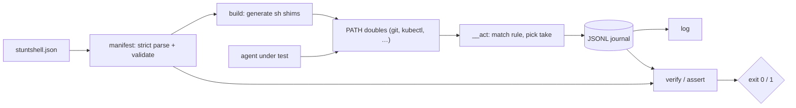

# stuntshell

[English](README.md) | [中文](README.zh.md) | [日本語](README.ja.md)

[](LICENSE) [](go.mod) [](CHANGELOG.md)  [](CONTRIBUTING.md)

**stuntshell：an open-source, zero-dependency CLI that generates fake command-line executables — stunt doubles — from a declarative manifest, journals every invocation, and asserts on the result, so agents that run `git` or `kubectl` can be tested deterministically.**


```bash
git clone https://github.com/JaydenCJ/stuntshell && cd stuntshell
go build -o stuntshell ./cmd/stuntshell    # single static binary, stdlib only
```

> Pre-release: v0.1.0 is not tagged on a package registry yet; build from source as above (any Go ≥1.22).

## Why stuntshell?

Anyone testing an AI agent (or any automation) that runs shell commands hits the same wall: you cannot let the test suite actually `git push` or `kubectl delete`, so you fake the commands on PATH. The usual fakes are all weak in the same ways. Hand-rolled stub scripts scatter behavior across a dozen files, drift from each other, and record nothing — you learn *that* the test failed, never *what the agent actually ran*. Shell-function mocks (the bats-mock / shellmock family) only exist inside one bash process, so they vanish the moment your agent runs commands from Python, Node, or a spawned subprocess. And asserting "the agent never force-pushed" usually means grepping ad-hoc log files that each stub formats differently. stuntshell replaces all of that with one manifest: declare each double's rules (per-token globs, scripted fail-then-succeed sequences, default responses), `stuntshell build` generates real executables that work for *any* caller on PATH, every invocation lands in one timestamp-free JSONL journal, and `stuntshell verify` judges the journal against declared expectations — counts, argv patterns, ordering, and strict "nothing unexpected ran" — with exit code 1 the moment the agent misbehaves.

| | stuntshell | hand-rolled PATH stubs | bats-mock / shellmock | patching the agent framework |
|---|---|---|---|---|
| Declarative manifest, validated up front | ✅ | ❌ ad-hoc scripts | ❌ per-test shell code | ❌ per-framework code |
| Works for any caller (Python, Node, subprocesses) | ✅ real executables | ✅ | ❌ bash-only functions | ❌ that framework only |
| Invocation journal (argv, exit, cwd, stdin) | ✅ one JSONL file | ❌ DIY | partial, per-mock | varies |
| Count / argv / order / never-called assertions | ✅ built in | ❌ grep and pray | partial | ❌ DIY |
| Scripted sequences (fail twice, then succeed) | ✅ `script` takes | ❌ manual state files | partial | ❌ DIY |
| Catches invocations nobody anticipated | ✅ strict mode | ❌ | ❌ | ❌ |
| Runtime dependencies | 0 | 0 | bash + framework | the framework |

<sub>Comparison checked 2026-07-13: stuntshell imports the Go standard library only; generated shims are plain POSIX sh, so the doubles themselves have zero dependencies too.</sub>

## Features

- **Manifest-driven doubles** — one strict-parsed JSON file declares every fake command; unknown keys and pattern typos fail at `build` time, never silently at test time.
- **A real matching language** — per-token globs (`*`, `?`, escapes), a `...` rest token, catch-all and empty-argv rules, first-match-wins — precise enough that `push origin *` and `push --force ...` are different doubles.
- **Scripted takes for retry logic** — a rule's `script` answers the nth matching call with the nth response and repeats the last one after, so "fails twice, then succeeds" is three lines of JSON instead of a state file.
- **Everything journaled, nothing timed** — every invocation appends argv, matched rule, exit code, cwd, and optionally stdin to one JSONL journal with no timestamps, so identical runs produce byte-identical evidence.
- **Assertions that read like requirements** — `verify` checks declared expectations (exact or glob argv, `min`/`max`/`exactly`, listed order, strict no-surprises mode) and exits 1 with the violated expectation named; `assert` does the same ad hoc from flags.
- **Self-contained shims** — `build` bakes absolute, shell-quoted paths into tiny POSIX sh executables; prepend one directory to PATH and every process in the tree, whatever language, hits the doubles.
- **Zero dependencies, fully offline** — Go standard library only, no network, no telemetry; the fastest way to make `curl` "fail" is to never let anything actually connect.

## Quickstart

```bash
stuntshell init                 # writes a starter stuntshell.json (git + kubectl doubles)
stuntshell build                # stages executables into .stunts/bin
eval "$(stuntshell path)"       # doubles now shadow the real commands
```

Run the "agent" — here just your shell — and watch the doubles answer:

```text
$ git status
On branch main
nothing to commit, working tree clean
$ git push origin main          # allowed by the manifest: succeeds silently
$ git fetch origin              # scripted: first take fails like a dead network
fatal: unable to access remote
$ git fetch origin && echo recovered
recovered
```

Then judge the journal against the manifest's expectations (real captured output):

```text
$ stuntshell verify
stuntshell verify — 2 expectations, 4 invocations

  ok    git status                             called 1× (min 1)
  ok    never force-push                       called 0× (exactly 0)

verify: PASS
$ stuntshell log
4 invocations
    1  git status                               rule 0    exit 0
    2  git push origin main                     rule 1    exit 0
    3  git fetch origin                         rule 2    exit 128
    4  git fetch origin                         rule 2    exit 0
```

A complete agent test — doubles, a misbehaving agent, verification — is one file: see [examples/test-git-agent.sh](examples/test-git-agent.sh).

## The manifest at a glance

Full reference in [docs/manifest.md](docs/manifest.md); the pattern language in one table:

| Pattern | Matches |
|---|---|
| `"status"` | exactly that token, case-sensitive |
| `"*"` / `"v?"` | any run of characters / exactly one character |
| `"\\*"` | the literal character after the backslash |
| `"..."` (final position) | the rest of argv, zero or more tokens |
| `"match"` omitted | any argv — a catch-all rule |
| `"match": []` | only an empty argv |

Expectations use the same patterns plus counts: `min`, `max` (`"max": 0` = never), `exactly`, top-level `ordered` for sequence, and `strict` to reject any invocation no rule anticipated.

## CLI reference

`stuntshell <subcommand> [flags]` — exit codes: 0 ok, 1 expectation failed, 2 usage error, 3 runtime error. Generated doubles exit with whatever the matched response declares.

| Subcommand | Key flags | Effect |
|---|---|---|
| `init` | `--force` | write a starter manifest to build on |
| `build` | `--manifest` `--out` `--log` `--bin` | validate the manifest, stage doubles into `<out>/bin` |
| `path` | `--out` | print the PATH export line, ready for `eval` |
| `log` | `--log` `--format` `--command` | list journaled invocations (text or JSON) |
| `verify` | `--manifest` `--log` `--strict` `--format` | judge the journal against the manifest's expectations |
| `assert` | `--command` `--args` / `--args-glob` `--min` `--max` `--exactly` | one ad-hoc expectation from flags |
| `reset` | `--log` | truncate the journal for a fresh test case |

## Verification

This repository ships no CI; every claim above is verified by local runs:

```bash
go test ./...            # 90 deterministic tests, offline, < 5 s
bash scripts/smoke.sh    # doubles exercised through PATH, prints SMOKE OK
```

## Architecture



## Roadmap

- [x] v0.1.0 — manifest-driven doubles with glob/rest matching, scripted takes, placeholder expansion, JSONL journal, verify/assert with ordering and strict mode, 90 tests + smoke script
- [ ] `stuntshell run -- <cmd>` wrapper that stages, runs, and verifies in one step
- [ ] Response bodies from files (`stdout_file`) for large fixtures
- [ ] Journal diffing (`verify --against golden.jsonl`) for snapshot-style tests
- [ ] Optional per-command passthrough to the real binary with journaling
- [ ] Windows support (cmd/PowerShell shims)

See the [open issues](https://github.com/JaydenCJ/stuntshell/issues) for the full list.

## Contributing

Issues, discussions and pull requests are welcome — see [CONTRIBUTING.md](CONTRIBUTING.md) for the local workflow (format, vet, tests, `SMOKE OK`). Good entry points are labelled [good first issue](https://github.com/JaydenCJ/stuntshell/issues?q=is%3Aissue+is%3Aopen+label%3A%22good+first+issue%22), and design questions live in [Discussions](https://github.com/JaydenCJ/stuntshell/discussions).

## License

[MIT](LICENSE)
