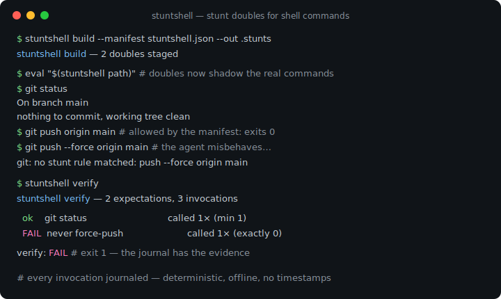
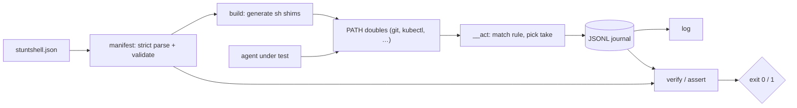

# stuntshell

[English](README.md) | [中文](README.zh.md) | [日本語](README.ja.md)

[](LICENSE) [](go.mod) [](CHANGELOG.md)  [](CONTRIBUTING.md)

**stuntshell：一个开源、零依赖的 CLI，从声明式 manifest 生成假的命令行可执行文件——「替身演员」——记录每一次调用并对结果做断言，让运行 `git` 或 `kubectl` 的 agent 可以被确定性地测试。**



```bash
git clone https://github.com/JaydenCJ/stuntshell && cd stuntshell
go build -o stuntshell ./cmd/stuntshell    # single static binary, stdlib only
```

> 预发布：v0.1.0 尚未在任何包注册表上打 tag；请按上面的方式从源码构建（任意 Go ≥1.22）。

## 为什么选 stuntshell？

任何测试「会执行 shell 命令的 AI agent（或任何自动化）」的人都会撞上同一堵墙：测试套件绝不能真的去 `git push` 或 `kubectl delete`，所以只能在 PATH 上伪造这些命令。常见的伪造手段全都弱在同样的地方。手写的 stub 脚本把行为散落在十几个文件里、彼此漂移、什么都不记录——你只知道测试失败了，却永远不知道 *agent 到底运行了什么*。shell 函数级 mock（bats-mock / shellmock 一族）只存在于单个 bash 进程里，agent 一旦从 Python、Node 或派生的子进程调用命令，它们就消失了。而要断言「agent 从未 force-push」，通常意味着去 grep 各个 stub 格式互不相同的临时日志。stuntshell 用一份 manifest 取代这一切：声明每个替身的规则（逐 token 的 glob、先失败后成功的脚本化序列、默认响应），`stuntshell build` 生成对 PATH 上*任何*调用方都生效的真实可执行文件，每次调用都落入同一个无时间戳的 JSONL 日志，`stuntshell verify` 再用声明好的期望——次数、argv 模式、顺序、以及严格的「没有任何意外调用」——来裁决日志，agent 一越界就以退出码 1 报错。

| | stuntshell | 手写 PATH stub | bats-mock / shellmock | 在 agent 框架层打补丁 |
|---|---|---|---|---|
| 声明式 manifest，预先校验 | ✅ | ❌ 临时脚本 | ❌ 每个测试写 shell | ❌ 每个框架写代码 |
| 对任何调用方生效（Python、Node、子进程） | ✅ 真实可执行文件 | ✅ | ❌ 仅限 bash 函数 | ❌ 仅限那个框架 |
| 调用日志（argv、退出码、cwd、stdin） | ✅ 单一 JSONL 文件 | ❌ 自己造 | 部分，各 mock 各自为政 | 因框架而异 |
| 次数 / argv / 顺序 / 从未调用 断言 | ✅ 内置 | ❌ grep 碰运气 | 部分 | ❌ 自己造 |
| 脚本化序列（失败两次后成功） | ✅ `script` 条目 | ❌ 手工状态文件 | 部分 | ❌ 自己造 |
| 捕获无人预料到的调用 | ✅ strict 模式 | ❌ | ❌ | ❌ |
| 运行时依赖 | 0 | 0 | bash + 框架 | 那个框架 |

<sub>对比核对于 2026-07-13：stuntshell 只 import Go 标准库；生成的 shim 是纯 POSIX sh，所以替身本身同样零依赖。</sub>

## 特性

- **manifest 驱动的替身** — 一个严格解析的 JSON 文件声明所有假命令；未知键和模式拼写错误在 `build` 时就报错，绝不在测试时静默失效。
- **真正的匹配语言** — 逐 token 的 glob（`*`、`?`、转义）、`...` 剩余 token、catch-all 与空 argv 规则、首个匹配生效——精确到 `push origin *` 和 `push --force ...` 是两个不同的替身。
- **为重试逻辑准备的脚本化 take** — 规则的 `script` 用第 n 个响应回应第 n 次匹配调用，之后重复最后一个，所以「失败两次然后成功」只是三行 JSON 而不是一个状态文件。
- **一切入账，绝无计时** — 每次调用把 argv、命中的规则、退出码、cwd、可选的 stdin 追加进一个不含时间戳的 JSONL 日志，相同的运行产生逐字节一致的证据。
- **像需求一样可读的断言** — `verify` 检查声明的期望（精确或 glob argv、`min`/`max`/`exactly`、列表顺序、严格无意外模式），失败时点名被违反的期望并以 1 退出；`assert` 用 flag 做同样的临时断言。
- **自包含的 shim** — `build` 把绝对、已做 shell 引号处理的路径烤进小小的 POSIX sh 可执行文件；往 PATH 前面加一个目录，进程树里任何语言的任何进程都会命中替身。
- **零依赖，完全离线** — 只用 Go 标准库，无网络、无遥测；让 `curl`「失败」的最快方式，就是根本不让任何东西真正连网。

## 快速上手

```bash
stuntshell init                 # writes a starter stuntshell.json (git + kubectl doubles)
stuntshell build                # stages executables into .stunts/bin
eval "$(stuntshell path)"       # doubles now shadow the real commands
```

运行「agent」——这里就是你的 shell——看替身如何应答：

```text
$ git status
On branch main
nothing to commit, working tree clean
$ git push origin main          # allowed by the manifest: succeeds silently
$ git fetch origin              # scripted: first take fails like a dead network
fatal: unable to access remote
$ git fetch origin && echo recovered
recovered
```

然后用 manifest 里的期望裁决日志（真实捕获的输出）：

```text
$ stuntshell verify
stuntshell verify — 2 expectations, 4 invocations

  ok    git status                             called 1× (min 1)
  ok    never force-push                       called 0× (exactly 0)

verify: PASS
$ stuntshell log
4 invocations
    1  git status                               rule 0    exit 0
    2  git push origin main                     rule 1    exit 0
    3  git fetch origin                         rule 2    exit 128
    4  git fetch origin                         rule 2    exit 0
```

一个完整的 agent 测试——替身、越界的 agent、验证——就是一个文件：见 [examples/test-git-agent.sh](examples/test-git-agent.sh)。

## manifest 一览

完整参考见 [docs/manifest.md](docs/manifest.md)；模式语言一表看懂：

| 模式 | 匹配 |
|---|---|
| `"status"` | 恰好该 token，区分大小写 |
| `"*"` / `"v?"` | 任意长度的字符 / 恰好一个字符 |
| `"\\*"` | 反斜杠后的字面字符 |
| `"..."`（仅末位） | argv 的剩余部分，零个或多个 token |
| 省略 `"match"` | 任何 argv——catch-all 规则 |
| `"match": []` | 仅空 argv |

期望使用同一套模式，外加计数：`min`、`max`（`"max": 0` = 从不）、`exactly`、顶层 `ordered` 约束顺序，以及 `strict` 拒绝任何无规则预料到的调用。

## CLI 参考

`stuntshell <subcommand> [flags]` — 退出码：0 正常，1 期望失败，2 用法错误，3 运行时错误。生成的替身按命中响应声明的退出码退出。

| 子命令 | 关键 flag | 作用 |
|---|---|---|
| `init` | `--force` | 写出一份可在其上扩展的起步 manifest |
| `build` | `--manifest` `--out` `--log` `--bin` | 校验 manifest，把替身部署到 `<out>/bin` |
| `path` | `--out` | 打印 PATH export 行，可直接 `eval` |
| `log` | `--log` `--format` `--command` | 列出日志中的调用（文本或 JSON） |
| `verify` | `--manifest` `--log` `--strict` `--format` | 用 manifest 的期望裁决日志 |
| `assert` | `--command` `--args` / `--args-glob` `--min` `--max` `--exactly` | 用 flag 做一条临时期望 |
| `reset` | `--log` | 清空日志，开始新的测试用例 |

## 验证

本仓库不附带 CI；上面的每一条声明都由本地运行验证：

```bash
go test ./...            # 90 deterministic tests, offline, < 5 s
bash scripts/smoke.sh    # doubles exercised through PATH, prints SMOKE OK
```

## 架构



## 路线图

- [x] v0.1.0 — manifest 驱动的替身（glob/rest 匹配）、脚本化 take、占位符展开、JSONL 日志、带顺序与 strict 模式的 verify/assert、90 个测试 + smoke 脚本
- [ ] `stuntshell run -- <cmd>` 包装器：一步完成部署、运行、验证
- [ ] 从文件读取响应体（`stdout_file`）以支持大型 fixture
- [ ] 日志对比（`verify --against golden.jsonl`），做快照式测试
- [ ] 可选的按命令透传真实二进制并记录日志
- [ ] Windows 支持（cmd/PowerShell shim）

完整列表见 [open issues](https://github.com/JaydenCJ/stuntshell/issues)。

## 参与贡献

欢迎 issue、讨论与 PR——本地工作流（format、vet、测试、`SMOKE OK`）见 [CONTRIBUTING.md](CONTRIBUTING.md)。入门任务标着 [good first issue](https://github.com/JaydenCJ/stuntshell/issues?q=is%3Aissue+is%3Aopen+label%3A%22good+first+issue%22)，设计讨论在 [Discussions](https://github.com/JaydenCJ/stuntshell/discussions)。

## 许可证

[MIT](LICENSE)
